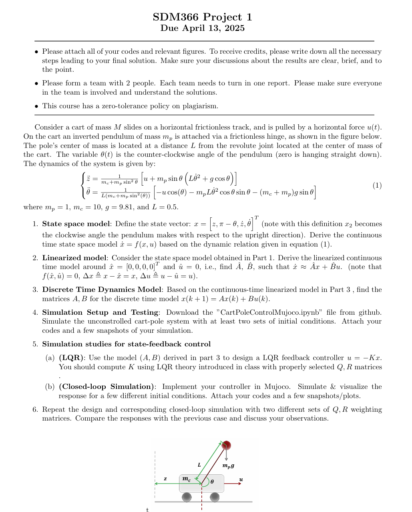

### Project内容

### 1. 系统动力学方程
$$
\dot{x}=\begin{bmatrix} 
\dot{z} \\ 
-\dot{\theta} \\ 
\ddot{z} \\ 
\ddot{\theta} \end{bmatrix} =
\begin{bmatrix} 
\dot{z} \\
-\dot{\theta} \\
\frac{1}{m_c + m_p \sin^2\theta} \left[u + m_p \sin\theta (L\dot{\theta}^2 + g \cos\theta)\right] \\
\frac{1}{L(m_c + m_p \sin^2\theta)} \left[-u \cos\theta - m_pL\dot{\theta}^2 \cos\theta \sin\theta - (m_c+m_p)g\sin\theta\right] 
\end{bmatrix}
$$

### 2. 线性化状态空间模型
$$
\hat{A} = \frac{\partial f(x, u)}{\partial x} \bigg|_{(\hat{x}, \hat{u})} = \begin{bmatrix} 
0 & 0 & 1 & 0 \\ 
0 & 0 & 0 & -1 \\ 
0 & -\frac{m_p g}{m_c} & 0 & 0 \\ 
0 & -\frac{(m_c+m_p)g}{Lm_c} & 0 & 0 
\end{bmatrix}=
\begin{bmatrix} 
0 & 0 & 1 & 0 \\ 
0 & 0 & 0 & -1 \\ 
0 & -0.98 & 0 & 0 \\ 
0 & -21.582 & 0 & 0 
\end{bmatrix}
$$

$$
\hat{B}=\frac{\partial f(x, u)}{\partial u} \bigg|_{(\hat{x}, \hat{u})}=\begin{bmatrix} 
0 \\ 
0 \\ 
\frac{1}{m_c} \\ 
\frac{1}{Lm_c} 
\end{bmatrix}=
\begin{bmatrix} 
0 \\ 
0 \\ 
0.1 \\ 
0.2 
\end{bmatrix}
$$

### 3. 离散时间状态方程
$$
x(k+1) = Ax(k) + Bu(k) = (I + \hat{A}T)x(k) + \hat{B}Tu(k) \\
= \begin{bmatrix}
1 & 0 & 1T & 0 \\
0 & 1 & 0 & -1T \\
0 & -0.98T & 1 & 0 \\
0 & -21.582T & 0 & 1
\end{bmatrix} x(k) +
\begin{bmatrix}
0 \\
0 \\
0.1 \\
0.2
\end{bmatrix} Tu(k)
$$

### 参数调整分析
- **Q 矩阵作用**  
  对系统状态误差加权。增大 $Q$ 元素会：
  - 强化对应状态的误差惩罚
  - 加快系统收敛速度
  - 减小超调量
  - 增加控制能量消耗

- **R 矩阵作用**  
  控制输入能量加权。增大 $R$ 会：
  - 抑制控制输入幅值
  - 降低能量消耗
  - 可能降低动态响应性能

- **设计权衡**  
  - $Q$ 过小 → 响应变慢/收敛延迟/抗扰动能力下降  
  - $R$ 过小 → 控制能量消耗增加/执行器饱和风险
 
